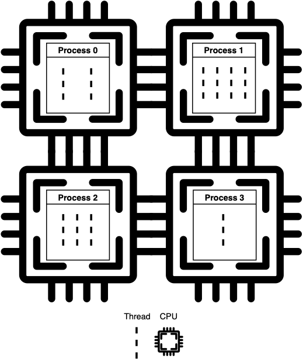

## Multithreading vs Multiprocessing

When looking for the difference between python ```multiprocessing``` and ```multithreading```, it can give the impression that they work pretty much the same. That could not be more wrong. The key differences are:

- A process is an independent instance executed in a processor core. Threads are components of a process and run concurrently (inside that process).
- Processes do not share the same memory space, while threads do (their mother’s memory, poetic, right?).
- Threads are lighter and cause less overhead. Also, because they share the same memory inside a process, it is easier, faster, and safer to share data.
- True parallelism can ONLY be achieved using multiprocessing. That is because only one thread can be executed at a given time inside a process time-space. This is assured by Python’s global interpreter lock (GIL).
- Processes execution is scheduled by the operating system, while threads are scheduled by the GIL.

We should also understand the difference between concurrency and parallelism.
- __Concurrent__ execution means that two or more tasks are progressing at the same time.
- __Parallel__ execution implies that two or more jobs are being executed simultaneously.

Now remember: ```multithreading``` implements concurrency, ```multiprocessing``` implements parallelism. Processes run on separate processing nodes.



### The Use Cases

So how do we decide between ```multiprocessing``` and ```multithreading```? The short answer is:
Multithreading for I/O intensive tasks and;
Multiprocessing for CPU intensive tasks (if you have multiple cores available)
But why?

### Multithreading: I/O bound tasks

Imagine you have a task that relies on the input from another part of the system, or from the user.

There is no reason to dedicate a process for that job because it would spend most of its time waiting for the stimuli to begin its work. It would be a waste of resources to dedicate a computing node for that, and it would bring no speedup whatsoever, given that the bottleneck is not on execution but on a third-party call. In this case, multithreading is the way to go.

Indeed, multithreading is usually implemented to handle GUIs. E.g., in a text editor program, one thread would be responsible for getting input from the keyboard, while another would check the spelling, and a third one could handle the formatting configurations.

I/O intensive programs can also directly benefit from multithreading because their bottlenecks are usually reading or writing operations (or downloads in the case of web scrappers, for example). Check the following example:

    def io_intensive(x):
        write_count = 50
        with urllib.request.urlopen(addrs[x], timeout=20) as conn:
            page = conn.read()
            for _ in range(write_count):
                with open('output.txt', 'w') as output:
                    output.write(str(page))

This function loads some URL addresses into memory and writes them in a local text file (50 times, always overwriting the same file). That is pretty dumb, but its purpose is just to stress an I/O bound execution.

Let us run that method over a list of 16 addresses and check their execution times for some different thread counts. That would get us the following graph (executing on a MacBook Air 2019).


Where the result for one thread stands for the serial execution of the code. We can see by the graphs that ```multithreading``` is capable of considerably reducing the algorithm’s execution time. We could keep increasing the number of threads, but the gains would stop once we reach the point where each address is handled by a thread.

### Multiprocessing: CPU bound tasks

Now imagine you got a massive amount of data loaded in memory, and it all needs to be processed. Programs that are computing-bound will benefit from multiprocessing because their bottleneck is time and resources. Image and graphics processing are an excellent example of that. They consist of vast amounts of math operations, which can often be divided into separate tasks because their data is independent. GPUs are the state-of-the-art hardware in this regard, being designed to process large chunks of data in parallel.

To simulate computing-intensive algorithm, we will use the following code:

    def compute_intensive(x):
        foo = 0
        for i in range(10**7):
            foo += foo * math.cos(i*math.pi)

The MacBook features a dual-core processor with hyper-threading, so there is no use to force more than 4 processes running on it. Those are the results for the performance tests on this benchmark:


The ```multithreading``` provided no speedup (the execution times are virtually the same). However, we had a significant speedup when using ```multiprocessing```. It was not enough to drop the execution time to one fourth of the original because of the time spent with process management. Remember that processes are much heavier than threads.

### Multiprocessing on I/O intensive tasks

Even though this is not their best use case, there is no reason to expect ```multiprocessing``` to perform poorly on I/O intensive tasks. It is a waste of resources: imagine dedicating a processor core to a function that will, for a significant part of its execution, just wait for an input. A processor, even a cluster, only has so many processing nodes. We are better off dedicating them to real parallelism of applications that can only be accelerated by those means.
But for the sake of science, what would happen if we executed the first I/O-bound code using ```multiprocessing```? The following graph shows it.


As expected, ```multiprocessing``` is also able to provide speedup on I/O bound computations. It is also noticeable that we kept the speedup even with 8 processes. The reason for that is processes start executing like threads in this case. The speedup is not coming from the parallelism, but from concurrency.

## What Is the Python Global Interpreter Lock (GIL)?

The Python Global Interpreter Lock or GIL, in simple words, is a mutex (or a lock) that allows only one thread to hold the control of the Python interpreter.

This means that only one thread can be in a state of execution at any point in time. The impact of the GIL isn’t visible to developers who execute single-threaded programs, but it can be a performance bottleneck in CPU-bound and multi-threaded code.

Since the GIL allows only one thread to execute at a time even in a multi-threaded architecture with more than one CPU core, the GIL has gained a reputation as an “infamous” feature of Python.

### What Problem Did the GIL Solve for Python?
Python uses reference counting for memory management. It means that objects created in Python have a reference count variable that keeps track of the number of references that point to the object. When this count reaches zero, the memory occupied by the object is released.

Let’s take a look at a brief code example to demonstrate how reference counting works:

    >>> import sys
    >>> a = []
    >>> b = a
    >>> sys.getrefcount(a)
    3

In the above example, the reference count for the empty list object [] was 3. The list object was referenced by a, b and the argument passed to sys.getrefcount().

Back to the GIL:

The problem was that this reference count variable needed protection from race conditions where two threads increase or decrease its value simultaneously. If this happens, it can cause either leaked memory that is never released or, even worse, incorrectly release the memory while a reference to that object still exists. This can cause crashes or other “weird” bugs in your Python programs.

This reference count variable can be kept safe by adding locks to all data structures that are shared across threads so that they are not modified inconsistently.

But adding a lock to each object or groups of objects means multiple locks will exist which can cause another problem—Deadlocks (deadlocks can only happen if there is more than one lock). Another side effect would be decreased performance caused by the repeated acquisition and release of locks.

The GIL is a single lock on the interpreter itself which adds a rule that execution of any Python bytecode requires acquiring the interpreter lock. This prevents deadlocks (as there is only one lock) and doesn’t introduce much performance overhead. But it effectively makes any CPU-bound Python program single-threaded.

The GIL, although used by interpreters for other languages like Ruby, is not the only solution to this problem. Some languages avoid the requirement of a GIL for thread-safe memory management by using approaches other than reference counting, such as garbage collection.

On the other hand, this means that those languages often have to compensate for the loss of single threaded performance benefits of a GIL by adding other performance boosting features like JIT compilers.

### Why Was the GIL Chosen as the Solution?

So, why was an approach that is seemingly so obstructing used in Python? Was it a bad decision by the developers of Python?

Well, in the words of Larry Hastings, the design decision of the GIL is one of the things that made Python as popular as it is today.

Python has been around since the days when operating systems did not have a concept of threads. Python was designed to be easy-to-use in order to make development quicker and more and more developers started using it.

A lot of extensions were being written for the existing C libraries whose features were needed in Python. To prevent inconsistent changes, these C extensions required a thread-safe memory management which the GIL provided.

The GIL is simple to implement and was easily added to Python. It provides a performance increase to single-threaded programs as only one lock needs to be managed.

C libraries that were not thread-safe became easier to integrate. And these C extensions became one of the reasons why Python was readily adopted by different communities.

As you can see, the GIL was a pragmatic solution to a difficult problem that the CPython developers faced early on in Python’s life.

### The Impact on Multi-Threaded Python Programs

When you look at a typical Python program—or any computer program for that matter—there’s a difference between those that are CPU-bound in their performance and those that are I/O-bound.

CPU-bound programs are those that are pushing the CPU to its limit. This includes programs that do mathematical computations like matrix multiplications, searching, image processing, etc.

I/O-bound programs are the ones that spend time waiting for Input/Output which can come from a user, file, database, network, etc. I/O-bound programs sometimes have to wait for a significant amount of time till they get what they need from the source due to the fact that the source may need to do its own processing before the input/output is ready, for example, a user thinking about what to enter into an input prompt or a database query running in its own process.

Let’s have a look at a simple CPU-bound program that performs a countdown:

    # single_threaded.py
    import time
    from threading import Thread

    COUNT = 50000000

    def countdown(n):
        while n>0:
            n -= 1

    start = time.time()
    countdown(COUNT)
    end = time.time()

    print('Time taken in seconds -', end - start)

Running this code on my system with 4 cores gave the following output:

    $ python single_threaded.py
    Time taken in seconds - 6.20024037361145

Now I modified the code a bit to do to the same countdown using two threads in parallel:

    # multi_threaded.py
    import time
    from threading import Thread

    COUNT = 50000000

    def countdown(n):
        while n>0:
            n -= 1

    t1 = Thread(target=countdown, args=(COUNT//2,))
    t2 = Thread(target=countdown, args=(COUNT//2,))

    start = time.time()
    t1.start()
    t2.start()
    t1.join()
    t2.join()
    end = time.time()

    print('Time taken in seconds -', end - start)

And when I ran it again:

    $ python multi_threaded.py
    Time taken in seconds - 6.924342632293701

As you can see, both versions take almost same amount of time to finish. In the multi-threaded version the GIL prevented the CPU-bound threads from executing in parellel.

The GIL does not have much impact on the performance of I/O-bound multi-threaded programs as the lock is shared between threads while they are waiting for I/O.

But a program whose threads are entirely CPU-bound, e.g., a program that processes an image in parts using threads, would not only become single threaded due to the lock but will also see an increase in execution time, as seen in the above example, in comparison to a scenario where it was written to be entirely single-threaded.

This increase is the result of acquire and release overheads added by the lock.

### Why Hasn’t the GIL Been Removed Yet?

The developers of Python receive a lot of complaints regarding this but a language as popular as Python cannot bring a change as significant as the removal of GIL without causing backward incompatibility issues.

The GIL can obviously be removed and this has been done multiple times in the past by the developers and researchers but all those attempts broke the existing C extensions which depend heavily on the solution that the GIL provides.

Of course, there are other solutions to the problem that the GIL solves but some of them decrease the performance of single-threaded and multi-threaded I/O-bound programs and some of them are just too difficult. After all, you wouldn’t want your existing Python programs to run slower after a new version comes out, right?

The creator and BDFL of Python, Guido van Rossum, gave an answer to the community in September 2007 in his article “It isn’t Easy to remove the GIL”:

    “I’d welcome a set of patches into Py3k only if the performance for a single-threaded program (and for a multi-threaded but I/O-bound program) does not decrease”

And this condition hasn’t been fulfilled by any of the attempts made since.

Why Wasn’t It Removed in Python 3?
Python 3 did have a chance to start a lot of features from scratch and in the process, broke some of the existing C extensions which then required changes to be updated and ported to work with Python 3. This was the reason why the early versions of Python 3 saw slower adoption by the community.

### But why wasn’t GIL removed alongside?

Removing the GIL would have made Python 3 slower in comparison to Python 2 in single-threaded performance and you can imagine what that would have resulted in. You can’t argue with the single-threaded performance benefits of the GIL. So the result is that Python 3 still has the GIL.

But Python 3 did bring a major improvement to the existing GIL—

We discussed the impact of GIL on “only CPU-bound” and “only I/O-bound” multi-threaded programs but what about the programs where some threads are I/O-bound and some are CPU-bound?

In such programs, Python’s GIL was known to starve the I/O-bound threads by not giving them a chance to acquire the GIL from CPU-bound threads.

This was because of a mechanism built into Python that forced threads to release the GIL __after a fixed interval__ of continuous use and if nobody else acquired the GIL, the same thread could continue its use.

    >>> import sys
    >>> # The interval is set to 100 instructions:
    >>> sys.getcheckinterval()
    100

The problem in this mechanism was that most of the time the CPU-bound thread would reacquire the GIL itself before other threads could acquire it.

This problem was fixed in Python 3.2 in 2009 by Antoine Pitrou who added a mechanism of looking at the number of GIL acquisition requests by other threads that got dropped and not allowing the current thread to reacquire GIL before other threads got a chance to run.

### How to Deal With Python’s GIL

If the GIL is causing you problems, here a few approaches you can try:

Multi-processing vs multi-threading: The most popular way is to use a multi-processing approach where you use multiple processes instead of threads. Each Python process gets its own Python interpreter and memory space so the GIL won’t be a problem. Python has a multiprocessing module which lets us create processes easily like this:

    from multiprocessing import Pool
    import time

    COUNT = 50000000
    def countdown(n):
        while n>0:
            n -= 1

    if __name__ == '__main__':
        pool = Pool(processes=2)
        start = time.time()
        r1 = pool.apply_async(countdown, [COUNT//2])
        r2 = pool.apply_async(countdown, [COUNT//2])
        pool.close()
        pool.join()
        end = time.time()
        print('Time taken in seconds -', end - start)

Running this on my system gave this output:

    $ python multiprocess.py
    Time taken in seconds - 4.060242414474487

A decent performance increase compared to the multi-threaded version, right?

The time didn’t drop to half of what we saw above because process management has its own overheads. Multiple processes are heavier than multiple threads, so, keep in mind that this could become a scaling bottleneck.

Alternative Python interpreters: Python has multiple interpreter implementations. CPython, Jython, IronPython and PyPy, written in C, Java, C# and Python respectively, are the most popular ones. GIL exists only in the original Python implementation that is CPython. If your program, with its libraries, is available for one of the other implementations then you can try them out as well.

Just wait it out: While many Python users take advantage of the single-threaded performance benefits of GIL. The multi-threading programmers don’t have to fret as some of the brightest minds in the Python community are working to remove the GIL from CPython. One such attempt is known as the Gilectomy.

The Python GIL is often regarded as a mysterious and difficult topic. But keep in mind that as a Pythonista you’re usually only affected by it if you are writing C extensions or if you’re using CPU-bound multi-threading in your programs.